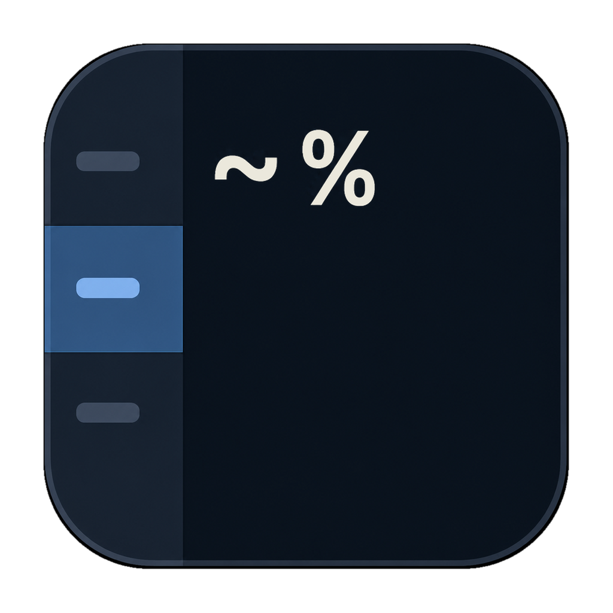
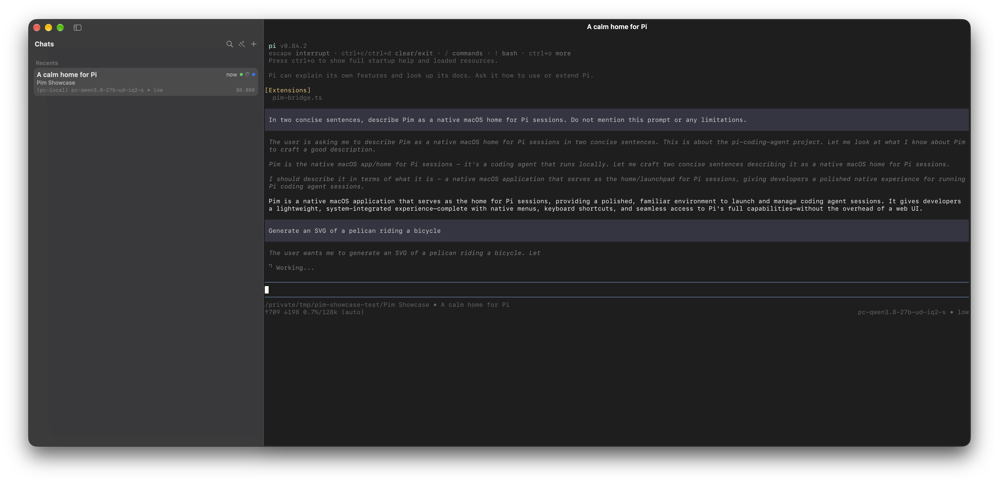

# Pim

<p align="center">
  
</p>

Pim is a native macOS session multiplexer for [Pi](https://github.com/earendil-works/pi).

It gives Pi a calm, macOS-native home: a resizable sidebar for navigating chats and an embedded Ghostty terminal for the selected session.

<p align="center">
  
</p>

> Pim is experimental and currently intended as a local development build.

## What Pim does

- Reads Pi's JSONL sessions directly; Pi remains the source of truth.
- Embeds Pi inside a pinned Ghostty/libghostty macOS build.
- Keeps visited sessions warm while allowing cold sessions to load on demand.
- Shows warm, working, cold, and unread state in the sidebar.
- Organizes sessions into **Pinned** and **Recents**.
- Supports local custom chat names and pinning without modifying Pi session files.
- Provides native chat search, including asynchronous transcript search.
- Uses native macOS split views, titlebar controls, menus, materials, and keyboard behavior.

Pim does not maintain a separate conversation database. Local presentation state—pins, names, and read markers—is stored in macOS `UserDefaults`.

## Requirements

- macOS
- Xcode and the macOS SDK
- Zig
- [Pi](https://github.com/earendil-works/pi) available on `PATH`, or configured with `PIM_PI_PATH`

## Build and run the native app

```sh
cd ~/pim
./macos/build-pim.sh
./macos/run-pim.sh
```

The first build compiles the pinned Ghostty checkout and may take a while. The result is an unsigned local app at:

```text
build/Pim.app
```

For a clean local screenshot environment without using your normal Pi sessions:

```sh
./macos/run-pim-clean.sh
```

This points both Pim and Pi at a temporary isolated agent directory, configures
an offline `Pim Demo Model`, and uses a temporary `Pim Demo` workspace. The
agent directory is removed when the app exits. It does not require a second
macOS user or a virtual machine. Pim also accepts `PIM_AGENT_DIR`, Pi's
`PI_CODING_AGENT_DIR`, and `PIM_WORKSPACE_DIR` when you want to choose alternate
locations yourself.

## Updating Ghostty

Ghostty is tracked in `vendor/ghostty` as a Git subtree. To pull a newer
upstream snapshot:

```sh
git subtree pull --prefix=vendor/ghostty \
  https://github.com/ghostty-org/ghostty.git main --squash
```

Resolve any conflicts in the Pim changes, then build and test Pim. The original
`macos-ghostty.patch` is retained as a historical reference; the tracked
subtree is the canonical source.

Pim currently starts without sandboxing because it needs to read Pi's local session directory and launch Pi processes.

## The original tmux prototype

The tmux prototype remains available and is useful for testing the basic session model without building the native app:

```sh
ln -sf "$HOME/pim/pim.py" "$HOME/.local/bin/pim"
pim
```

Run its self-test with:

```sh
python3 ~/pim/pim.py --self-test
```

The prototype requires `tmux` and Pi on `PATH`.

## Data and privacy

Pim reads sessions from Pi's local agent directory and does not upload conversation data. Be careful when sharing screenshots: terminal contents and session titles may contain private information.
